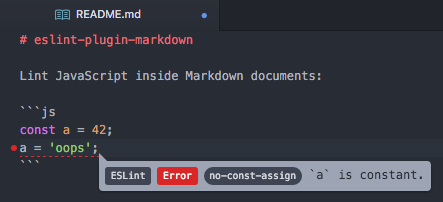

# ESLint Markdown Language Plugin

[](https://www.npmjs.com/package/@eslint/markdown)
[](https://www.npmjs.com/package/@eslint/markdown)
[](https://github.com/eslint/markdown/actions)

Lint JS, JSX, TypeScript, and more inside Markdown.



## Usage

### Installing

Install the plugin alongside ESLint v9 or greater:

```sh
npm install --save-dev eslint @eslint/markdown
```

### Configurations

| **Configuration Name** | **Description** |
|---------------|-----------------|
| `recommended` | Lints all `.md` files with the recommended rules and assumes [CommonMark](https://commonmark.org/) format. |
| `processor` | Enables extracting code blocks from all `.md` files so code blocks can be individually linted. |

In your `eslint.config.js` file, import `@eslint/markdown` and include the recommended config to enable the Markdown processor on all `.md` files:

```js
// eslint.config.js
import markdown from "@eslint/markdown";

export default [
    ...markdown.configs.recommended

    // your other configs here
];
```

### Rules

<!-- NOTE: The following table is autogenerated. Do not manually edit. -->

<!-- Rule Table Start -->
| **Rule Name** | **Description** | **Recommended** |
| :- | :- | :-: |
| [`fenced-code-language`](./docs/rules/fenced-code-language.md) | Require languages for fenced code blocks | yes |
| [`heading-increment`](./docs/rules/heading-increment.md) | Enforce heading levels increment by one | yes |
| [`no-duplicate-headings`](./docs/rules/no-duplicate-headings.md) | Disallow duplicate headings in the same document | no |
| [`no-empty-links`](./docs/rules/no-empty-links.md) | Disallow empty links | yes |
| [`no-html`](./docs/rules/no-html.md) | Disallow HTML tags | no |
| [`no-invalid-label-refs`](./docs/rules/no-invalid-label-refs.md) | Disallow invalid label references | yes |
| [`no-missing-label-refs`](./docs/rules/no-missing-label-refs.md) | Disallow missing label references | yes |
<!-- Rule Table End -->

**Note:** This plugin does not provide formatting rules. We recommend using a source code formatter such as [Prettier](https://prettier.io) for that purpose.

In order to individually configure a rule in your `eslint.config.js` file, import `@eslint/markdown` and configure each rule with a prefix:

```js
// eslint.config.js
import markdown from "@eslint/markdown";

export default [
    {
        files: ["**/*.md"],
        plugins: {
            markdown
        },
        language: "markdown/commonmark",
        rules: {
            "markdown/no-html": "error"
        }
    }
];
```

You can individually disable rules in Markdown using HTML comments, such as:

```markdown
<!-- eslint-disable-next-line markdown/no-html -- I want to allow HTML here -->
<custom-element>Hello world!</custom-element>

<!-- eslint-disable markdown/no-html -- here too -->
<another-element>Goodbye world!</another-element>
<!-- eslint-enable markdown/no-html -- safe to re-enable now -->

[Object] <!-- eslint-disable-line markdown/no-missing-label-refs -- not meant to be a link ref -->
```

### Languages

| **Language Name** | **Description** |
|---------------|-----------------|
| `commonmark` | Parse using [CommonMark](https://commonmark.org) Markdown format | 
| `gfm` | Parse using [GitHub-Flavored Markdown](https://github.github.com/gfm/) format | 

In order to individually configure a language in your `eslint.config.js` file, import `@eslint/markdown` and configure a `language`:

```js
// eslint.config.js
import markdown from "@eslint/markdown";

export default [
    {
        files: ["**/*.md"],
        plugins: {
            markdown
        },
        language: "markdown/gfm",
        rules: {
            "markdown/no-html": "error"
        }
    }
];
```

### Language Options

#### Enabling Front Matter in both `commonmark` and `gfm`

By default, Markdown parsers do not support [front matter](https://jekyllrb.com/docs/front-matter/). To enable front matter in both `commonmark` and `gfm`, you can use the `frontmatter` option in `languageOptions`.  

> `@eslint/markdown` internally uses [`micromark-extension-frontmatter`](https://github.com/micromark/micromark-extension-frontmatter) and [`mdast-util-frontmatter`](https://github.com/syntax-tree/mdast-util-frontmatter) to parse front matter.

| **Option Value** | **Description**                                            |
|------------------|------------------------------------------------------------|
| `false`          | Disables front matter parsing in Markdown files. (Default) |
| `"yaml"`         | Enables YAML front matter parsing in Markdown files.       |
| `"toml"`         | Enables TOML front matter parsing in Markdown files.       |

```js
// eslint.config.js
import markdown from "@eslint/markdown";

export default [
    {
        files: ["**/*.md"],
        plugins: {
            markdown
        },
        language: "markdown/gfm",
        languageOptions: {
            frontmatter: "yaml", // Or pass `"toml"` to enable TOML front matter parsing.
        },
        rules: {
            "markdown/no-html": "error"
        }
    }
];
```

### Processors

| **Processor Name** | **Description** |
|---------------|-----------------|
| [`markdown`](./docs/processors/markdown.md) | Extract fenced code blocks from the Markdown code so they can be linted separately. | 

## Editor Integrations

### VSCode

[`vscode-eslint`](https://github.com/microsoft/vscode-eslint) has built-in support for the Markdown processor.

## File Name Details

This processor will use file names from blocks if a `filename` meta is present.

For example, the following block will result in a parsed file name of `src/index.js`:

````md
```js filename="src/index.js"
export const value = "Hello, world!";
```
````

This can be useful for user configurations that include linting overrides for specific file paths. In this example, you could then target the specific code block in your configuration using `"file-name.md/*src/index.js"`.

## Contributing

```sh
$ git clone https://github.com/eslint/markdown.git
$ cd markdown
$ npm install
$ npm test
```

This project follows the [ESLint contribution guidelines](https://eslint.org/docs/latest/contribute/).

<!-- NOTE: This section is autogenerated. Do not manually edit.-->
<!--sponsorsstart-->

## Sponsors

The following companies, organizations, and individuals support ESLint's ongoing maintenance and development. [Become a Sponsor](https://eslint.org/donate)
to get your logo on our READMEs and [website](https://eslint.org/sponsors).

<h3>Diamond Sponsors</h3>
<p><a href="https://www.ag-grid.com/"></a></p><h3>Platinum Sponsors</h3>
<p><a href="https://automattic.com"></a> <a href="https://www.airbnb.com/"></a></p><h3>Gold Sponsors</h3>
<p><a href="https://qlty.sh/"></a> <a href="https://trunk.io/"></a> <a href="https://shopify.engineering/"></a></p><h3>Silver Sponsors</h3>
<p><a href="https://vite.dev/"></a> <a href="https://liftoff.io/"></a> <a href="https://americanexpress.io"></a> <a href="https://stackblitz.com"></a></p><h3>Bronze Sponsors</h3>
<p><a href="https://cybozu.co.jp/"></a> <a href="https://www.crosswordsolver.org/anagram-solver/"></a> <a href="https://icons8.com/"></a> <a href="https://discord.com"></a> <a href="https://www.gitbook.com"></a> <a href="https://nolebase.ayaka.io"></a> <a href="https://nx.dev"></a> <a href="https://opensource.mercedes-benz.com/"></a> <a href="https://herocoders.com"></a> <a href="https://www.lambdatest.com"></a></p>
<h3>Technology Sponsors</h3>
Technology sponsors allow us to use their products and services for free as part of a contribution to the open source ecosystem and our work.
<p><a href="https://netlify.com"></a> <a href="https://algolia.com"></a> <a href="https://1password.com"></a></p>
<!--sponsorsend-->
